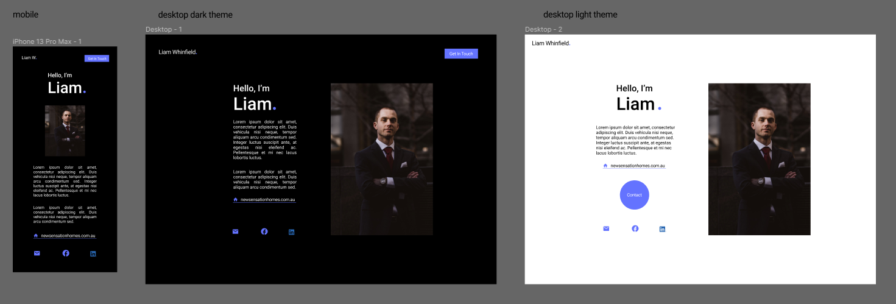
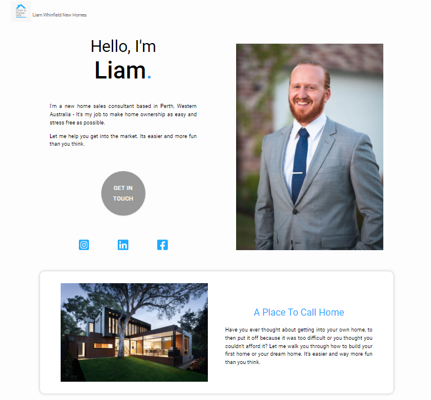

# Liams Landing Page

## Description
[Here is a link to the deployed site](https://www.ownahomewa.com/)

I designed, built and deployed this simple landing page for a friend (for free) to give him a presence on the web, and as a way for me to practice with some new technologies. I learnt a lot from this project as it was my first real foray into working with a client. Liam was consulted on the design and functionalilty of this landing page and the final product reflects his specific requirements.

---

Figma Design

---

Final Product

---

## Technologies Used

### Figma

- Used to design and prototype.
- Was very useful to quickly get feedback from liam on his preferred design before commiting to the build.

### Styled Components
- A Styling library for React.
- I enjoyed using styled components as it results in cleaner, component scoped css and made making responsiveness for mobile devices easier.

### Material UI
- A library of ready to go components for React which was great to use.
- This made the contact form look professional, with easy integration of a snackbar when a user submits the form.

### Email.js
- A third party service which allows for the sending of emails through forms by using js on the front-end, so no need for a backend to handle the contact form. This was great as it simplified this project.

### Hostinger
- A web hosting provider used to cheaply purchase web hosting and domain name.

### React
- Front-end framework.
- This project was great for me to practice using react and reinforce some of the fundamentals of js and react.

